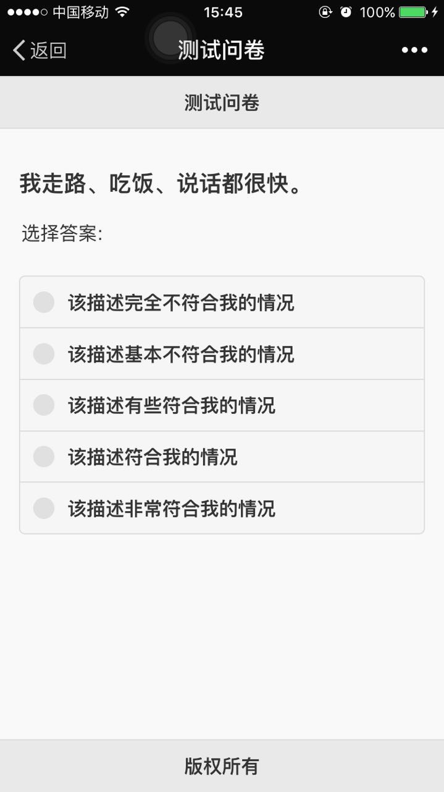
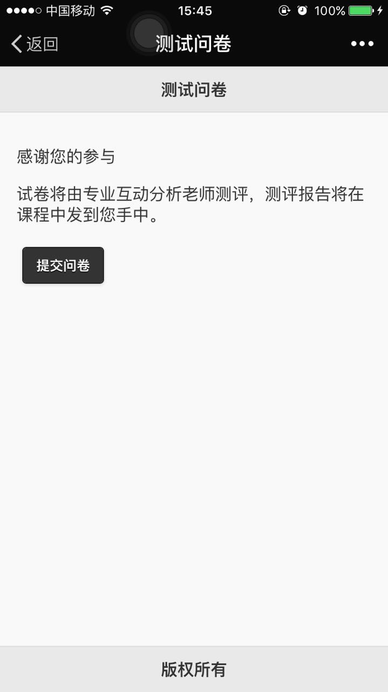

# Quiz Mobile

- - -

Quiz Mobile 使用

- - -

###### 安装依赖组件

    $ npm install
    $ npm install -g brunch

###### 启动服务器 

前端开发人员编写 index.html(app/assets/下), 每次开发前，启动服务器，在 http://localhost:3333 上访问本地应用

    $ brunch w

###### 优化和发布 

每次将最终产品发布到服务器上时，先运行此命令，然后将 public 上的内容传到服务器上

    $ brunch b -P

###### 注意事项

每次开发前先更新服务器上的代码

    $ git pull
    
每次修改完本地的代码后，提交自己的代码

    $ git add .                          # 添加所有的修改
    $ git commit -m 'xxx'                # 提交本次修改和附上说明文字
    $ git push origin master             # 推送代码到 github 服务器